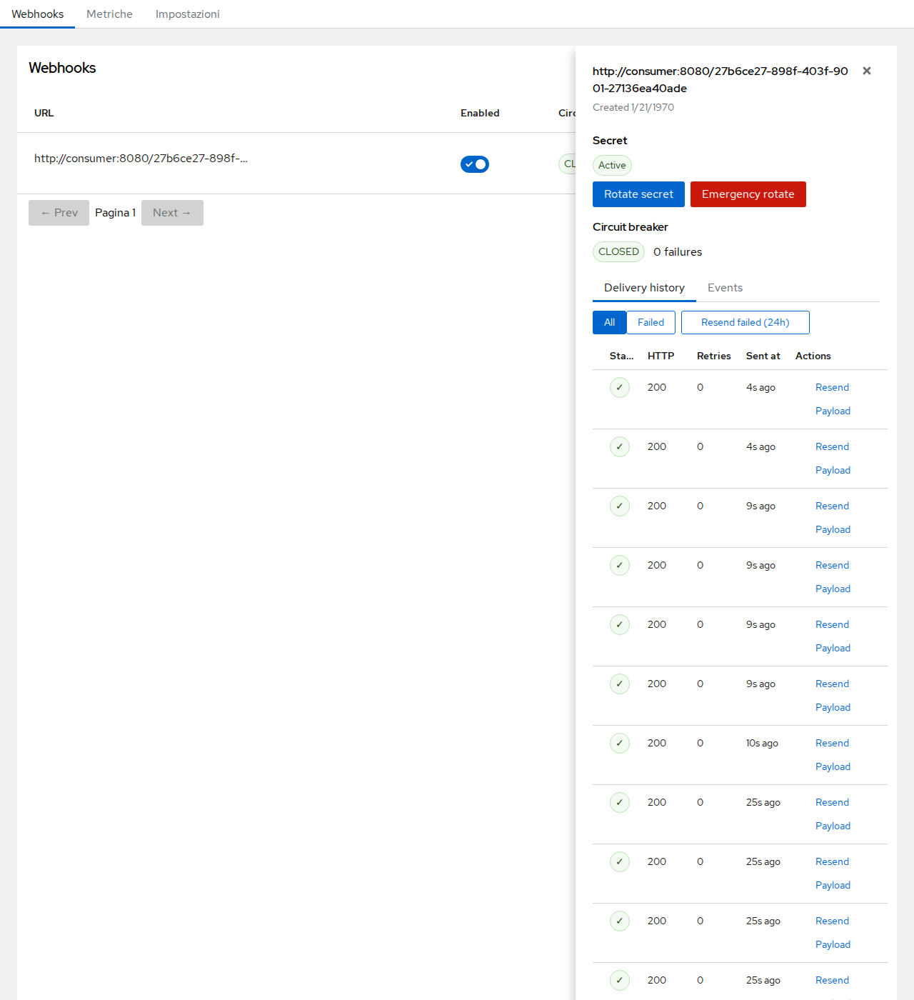
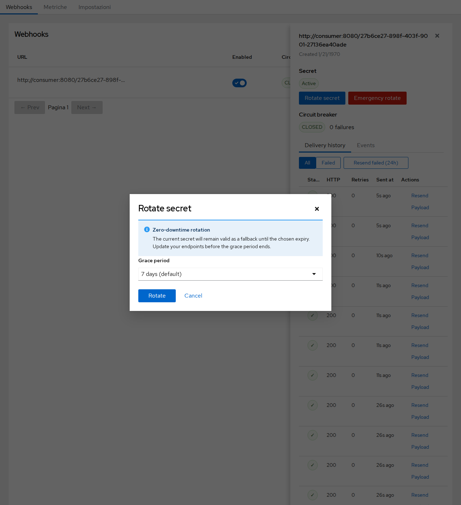
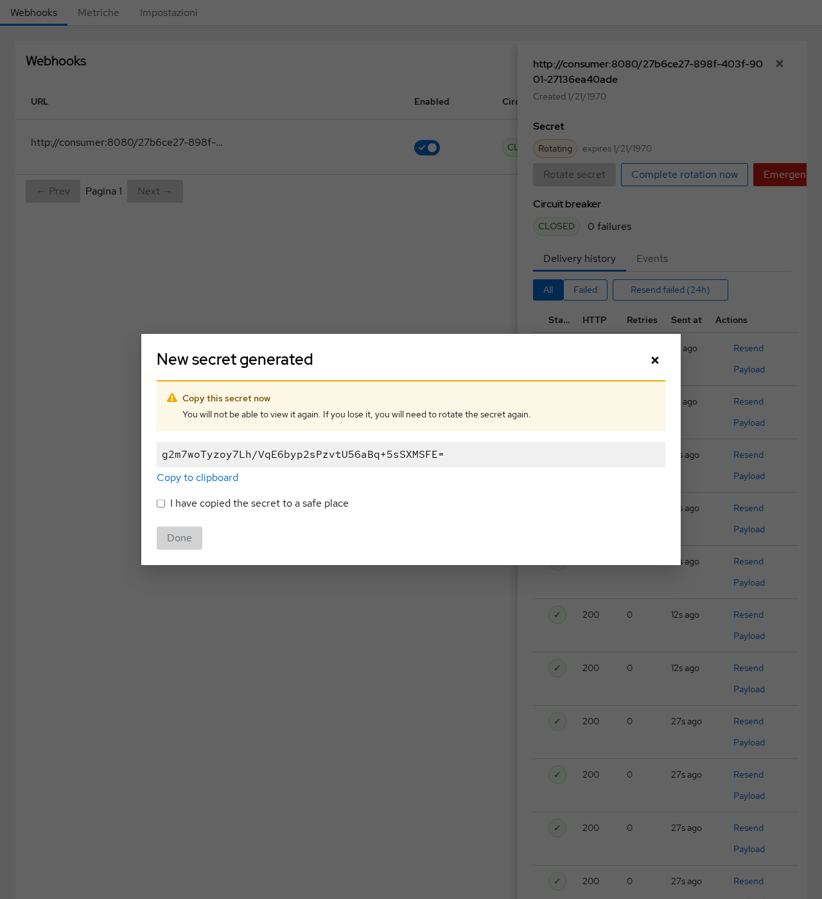
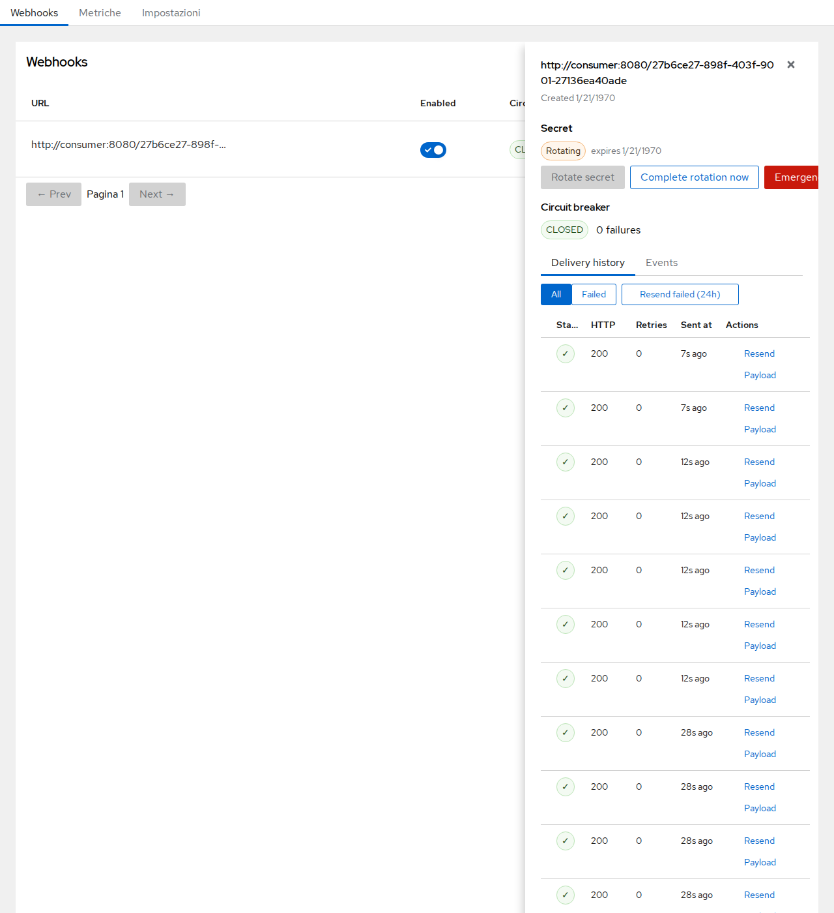

# Webhook Admin UI — User Guide

This guide covers the Webhook Admin UI, accessible at:

```
/realms/{realm}/webhooks/ui
```

Access requires the `webhook-admin` realm role.

---

## 1. Webhooks list


The main screen lists all webhooks configured in the realm. For each webhook you can see:

| Column | Description |
|--------|-------------|
| **URL** | The endpoint that receives POST requests |
| **Enabled** | Toggle to enable or disable delivery without deleting the webhook |
| **Circuit** | Current circuit-breaker state: `CLOSED` (healthy) or `OPEN` (tripped) |
| **Events** | Number of event types subscribed |
| **Actions** | Menu for edit and delete |

Click any row to open the **Delivery drawer** for that webhook.

---

## 2. Creating a webhook


Click **+ Create webhook** to open the creation form. Fill in:

- **URL** — the HTTPS endpoint that will receive events.
- **Enabled** — whether delivery starts immediately after creation.
- **Secret** — optional HMAC secret. When set, every request includes an `X-Webhook-Signature` header so the receiver can verify authenticity.
- **Algorithm** — HMAC algorithm for the signature (`HmacSHA256` recommended).
- **Max-retry duration** — total window in seconds during which retries are attempted (default: 900 s / 15 min).
- **Max-retry interval** — maximum back-off interval in seconds between retry attempts.

Click **Save** to create the webhook. Click **Cancel** or press `Esc` to discard.

---

## 3. Delivery history


Clicking a row opens a side drawer showing delivery details for that webhook.

The drawer header shows the full target **URL**.

### Secret

The **Secret** section shows the current signature key status (`Active` or `Rotating`). From here you can start a graceful rotation or trigger an emergency rotation. See [Section 7 — Secret Rotation](#7-secret-rotation) for details.

### Circuit breaker

Below the Secret section, the **Circuit breaker** status badge (`OPEN` / `CLOSED`) and a **Reset circuit** button let you inspect and manually reset the circuit. See [Section 4 — Circuit breaker](#4-circuit-breaker) for details.

### Delivery history tab

The **Delivery history** tab lists recent dispatch attempts. Each row shows:
- HTTP **status** code (green check = 2xx, red X = failure)
- Number of **retries** for that attempt
- **Sent at** timestamp
- An **Actions** column with **Resend** and **Payload** options

Use the **Resend failed** button to replay all failed deliveries for this webhook.

Click **Payload** on any row to open a modal showing the full JSON payload sent with that delivery.

### Events tab


The **Events** tab lists the raw Keycloak events received for this webhook, before they are dispatched. Each row shows:
- **Event type** (e.g. `USER`, `ADMIN`)
- **Captured at** timestamp
- An **Actions** column with a **Payload** button to inspect the event JSON

### Pagination

Use the **← Prev** and **Next →** buttons at the bottom of the delivery table to navigate between pages. The number of rows per page is configurable in **Settings → Delivery history** (default: 50). The **Next** button is disabled on the last page; **Prev** is disabled on the first page.

---

## 4. Circuit breaker


The circuit breaker protects downstream services from repeated failed requests. When too many consecutive deliveries fail, the circuit **trips** (state moves from `CLOSED` to `OPEN`) and delivery is suspended.

- **CLOSED** — the circuit is healthy; deliveries proceed normally.
- **OPEN** — the circuit has tripped; deliveries are paused until the circuit is reset.

Click **Reset circuit** in the drawer header to manually reopen the circuit and resume delivery.

---

## 5. Metrics


The **Metriche** tab shows aggregated delivery statistics for the realm.

| Card | Description |
|------|-------------|
| **Dispatches** | Total HTTP delivery attempts |
| **Events received** | Total Keycloak events received and queued |
| **Retries** | Total retry attempts scheduled |
| **Queue pending** | Tasks currently waiting in the executor |

The success rate is displayed below the dispatch count:
- **Green** — ≥ 95% success
- **Amber** — < 95% success

Use the **Auto-refresh** toggle to enable automatic refresh. The interval is configurable in the **Settings** tab (default: 10 seconds).  
Click **Aggiorna** to trigger an immediate refresh.

---

## 6. Raw Prometheus metrics


Expand the **Raw Prometheus** section at the bottom of the Metrics page to view the raw Prometheus text format output.

The same endpoint is also available directly for scraping:

```
GET /realms/{realm}/webhooks/metrics
Authorization: Bearer <token>
```

The response uses Prometheus text format 0.0.4 and exposes the following metric families:

| Metric | Type | Description |
|--------|------|-------------|
| `webhook_events_received_total` | counter | Events received by realm and type |
| `webhook_dispatches_total` | counter | Dispatch attempts by success/failure |
| `webhook_retries_total` | counter | Retry attempts scheduled |
| `webhook_retries_exhausted_total` | counter | Retry chains exhausted without success |
| `webhook_queue_pending` | gauge | Tasks pending in the executor |

---

## 7. Secret Rotation

Rotating a webhook secret is a two-phase, zero-downtime operation: while the rotation is in progress, outgoing requests carry signatures from both the new and the old secret, so consumers can update their verification key without losing events.

### Starting a rotation



Open the webhook in the admin UI and click **Rotate secret** in the drawer's Secret section.



Choose a grace period (1, 7, or 30 days) and click **Rotate**. A modal displays the new secret exactly once — copy it and configure it on the consumer side.



Check **I have copied the secret to a safe place** and click **Done**. The drawer updates to show a **Rotating** badge with the expiry date. The old secret continues to verify signatures until the grace period ends or you click **Complete rotation now**.



### Emergency rotation

If the current secret has been compromised, click **Emergency rotate**. You will be asked to type `rotate` to confirm. The new secret replaces the old one immediately — there is no grace period and the old secret is invalidated. Use this only for compromise; it will break any consumer still using the old secret until they are updated.

### Verifying multi-signature headers on the consumer side

During rotation, the `X-Keycloak-Signature` header contains a comma-separated list of signatures:

```
X-Keycloak-Signature: sha256=<hex1>, sha256=<hex2>
```

Verify by iterating over the signatures and accepting the payload if **any** signature matches:

```python
def verify(payload_bytes, header, secrets):
    parts = [p.strip() for p in header.split(",")]
    for part in parts:
        if not part.startswith("sha256="):
            continue
        received = part[len("sha256="):]
        for secret in secrets:
            expected = hmac.new(secret.encode(), payload_bytes, hashlib.sha256).hexdigest()
            if hmac.compare_digest(expected, received):
                return True
    return False
```

### Metrics and audit trail

- `webhook_secret_rotations_total{mode}` — count of rotations by mode (`graceful`, `emergency`, `expired`)
- `webhook_rotations_in_progress{realm}` — current number of rotating webhooks
- Structured log events: `webhook.secret.rotated`, `webhook.rotation.completed`, `webhook.rotation.expired`

---

## 8. Settings


The **Impostazioni** tab exposes UI configuration options that are persisted in the browser's `localStorage` across sessions.

### Metrics auto-refresh interval

Controls how often the Metrics page automatically polls the `/metrics` endpoint when **Auto-refresh** is enabled.

| Option | Value |
|--------|-------|
| 5 secondi | 5 s |
| **10 secondi** *(default)* | 10 s |
| 30 secondi | 30 s |
| 60 secondi | 60 s |

Select an option and the change takes effect immediately — no save required. The setting persists after a page reload.

### Webhook defaults

Default values applied when **creating** a new webhook. Existing webhooks are not affected.

| Setting | Default | Description |
|---------|---------|-------------|
| **Enabled by default** | On | Whether new webhooks start active (delivering events) immediately after creation. Turn off to create webhooks in a disabled state and enable them manually when ready. |
| **Max retry duration (seconds)** | Empty (server default: 900) | Total time window for retry attempts. Leave empty to use the server default (900 s / 15 min). |
| **Max retry interval (seconds)** | Empty (server default: 180) | Maximum back-off interval between retry attempts. Leave empty to use the server default (180 s / 3 min). |

All changes take effect immediately — no save required. Settings persist after a page reload.

### Delivery history

Controls the number of rows shown per page in the delivery history drawer.

| Option | Value |
|--------|-------|
| 10 | 10 rows |
| 25 | 25 rows |
| **50** *(default)* | 50 rows |
| 100 | 100 rows |

### Server configuration

Server-side settings that persist in the Keycloak database and apply across all users of the realm.

| Setting | Default | Description |
|---------|---------|-------------|
| **Event retention (days)** | 30 | How long raw Keycloak events are kept in the database before being purged. |
| **Send retention (days)** | 90 | How long delivery records (sends) are kept before being purged. |
| **Circuit failure threshold** | 5 | Number of consecutive delivery failures before the circuit trips to `OPEN`. |
| **Circuit open duration (seconds)** | 60 | How long the circuit stays `OPEN` before it can be manually reset. |

Changes are saved automatically on blur (no explicit save button required).
