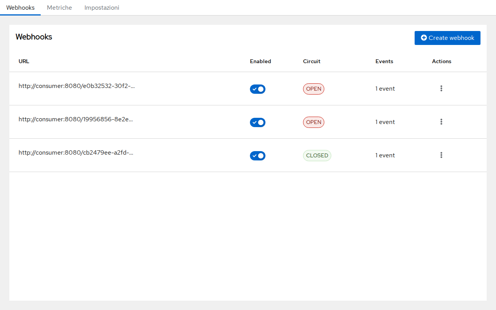
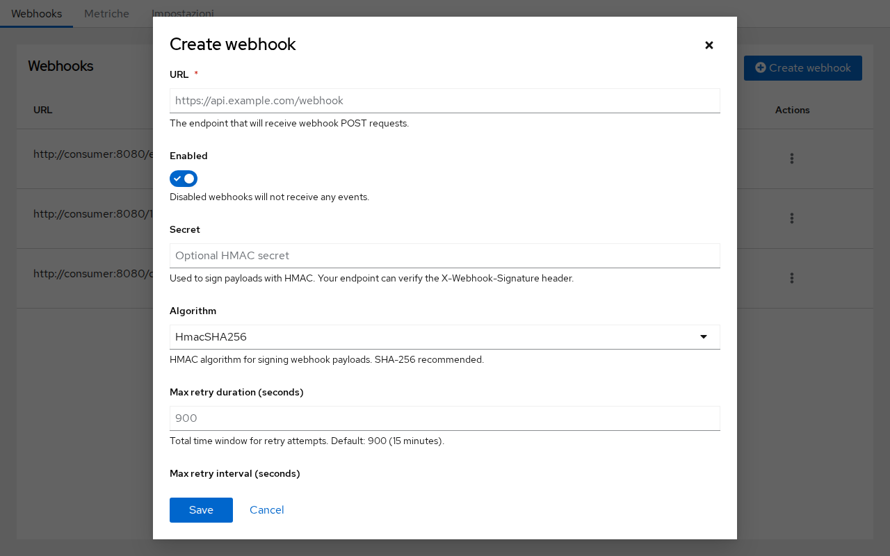
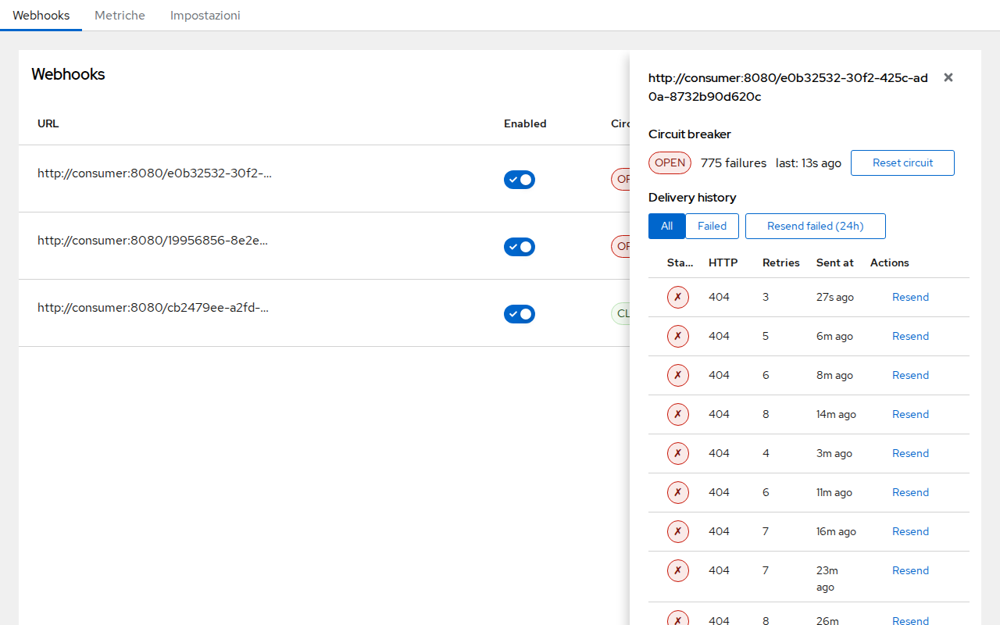
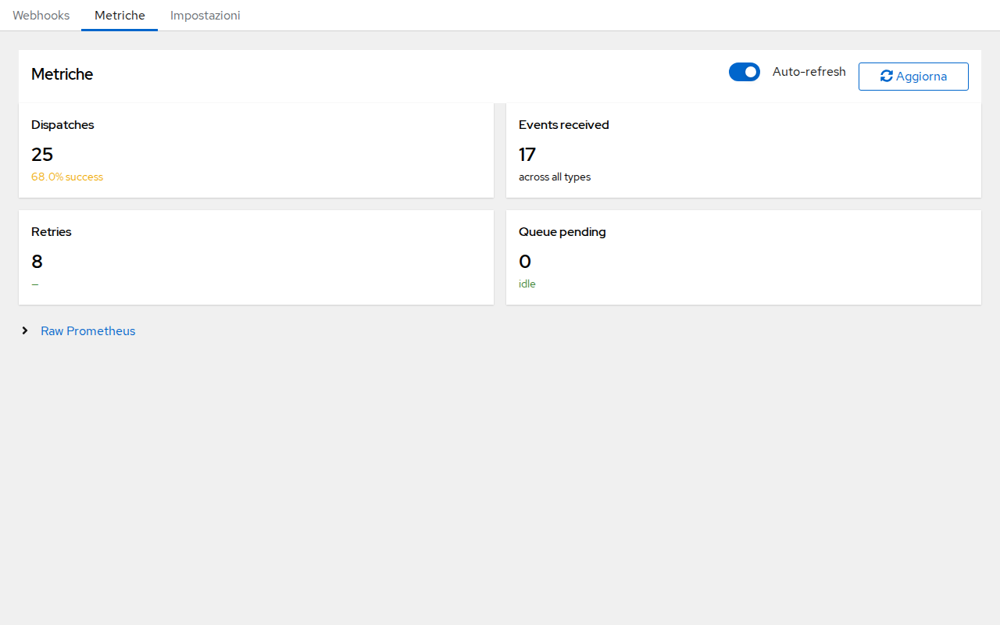
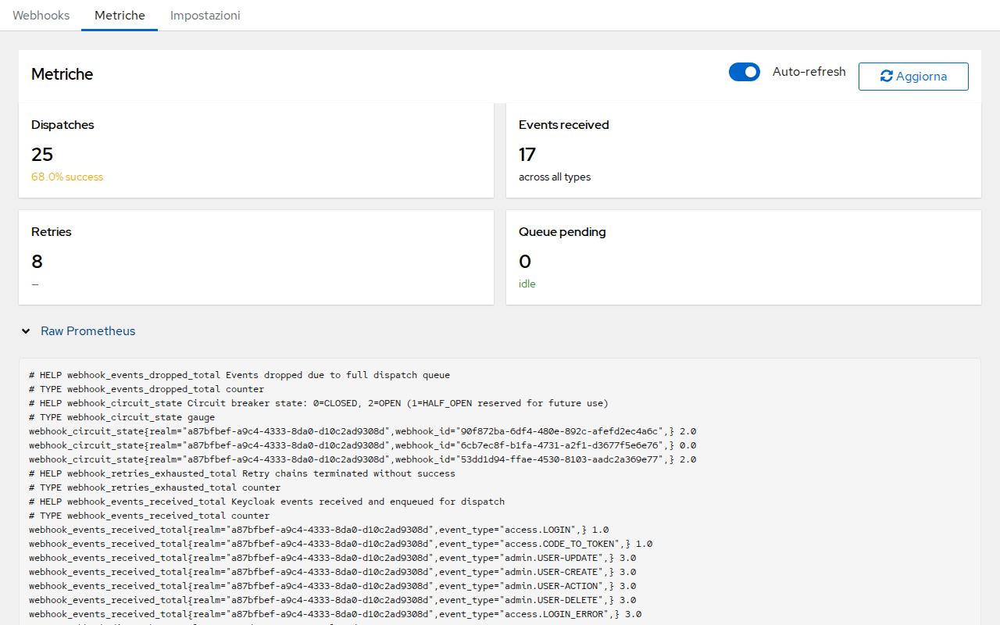
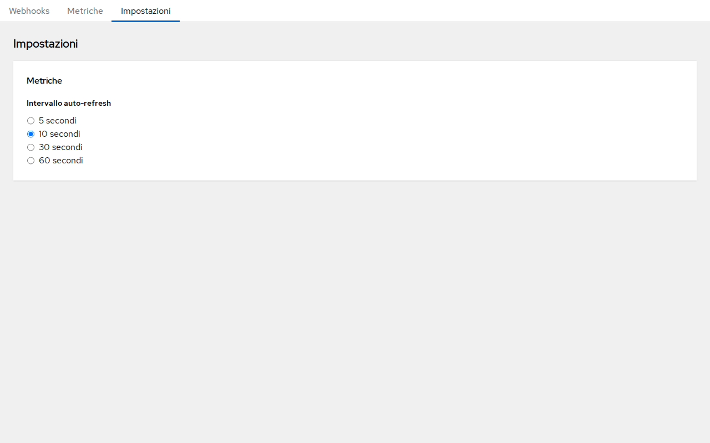

# Webhook Admin UI — User Guide

This guide covers the Webhook Admin UI, accessible at:

```
/realms/{realm}/webhooks/ui
```

Access requires the `webhook-admin` realm role.

---

## 1. Webhooks list



The main screen lists all webhooks configured in the realm. For each webhook you can see:

| Column | Description |
|--------|-------------|
| **URL** | The endpoint that receives POST requests |
| **Enabled** | Toggle to enable or disable delivery without deleting the webhook |
| **Circuit** | Current circuit-breaker state: `OPEN` (healthy) or `CLOSED` (tripped) |
| **Events** | Number of event types subscribed |
| **Actions** | Menu for edit and delete |

Click any row to open the **Delivery drawer** for that webhook.

---

## 2. Creating a webhook



Click **+ Create webhook** to open the creation form. Fill in:

- **URL** — the HTTPS endpoint that will receive events.
- **Enabled** — whether delivery starts immediately after creation.
- **Secret** — optional HMAC secret. When set, every request includes an `X-Webhook-Signature` header so the receiver can verify authenticity.
- **Algorithm** — HMAC algorithm for the signature (`HmacSHA256` recommended).
- **Max-retry duration** — total window in seconds during which retries are attempted (default: 900 s / 15 min).
- **Max-retry interval** — maximum back-off interval in seconds between retry attempts.

Click **Save** to create the webhook. Click **Cancel** or press `Esc` to discard.

---

## 3. Delivery history



Clicking a row opens a side drawer showing delivery details for that webhook.

The drawer header shows:
- The full target **URL**
- The **circuit-breaker** badge (`OPEN` / `CLOSED`) and a **Reset circuit** button

The **Delivery history** tab lists recent dispatch attempts. Each row shows:
- HTTP **status** code (green check = 2xx, red X = failure)
- Number of **retries** for that attempt
- **Start** timestamp
- An **Actions** column with a resend option

Use the **Resend failed** button to replay all failed deliveries for this webhook.

---

## 4. Circuit breaker


The circuit breaker protects downstream services from repeated failed requests. When too many consecutive deliveries fail, the circuit **trips** (state moves from `OPEN` to `CLOSED`) and delivery is suspended.

- **OPEN** — the circuit is healthy; deliveries proceed normally.
- **CLOSED** — the circuit has tripped; deliveries are paused until the circuit is reset.

Click **Reset circuit** in the drawer header to manually reopen the circuit and resume delivery.

---

## 5. Metrics



The **Metriche** tab shows aggregated delivery statistics for the realm.

| Card | Description |
|------|-------------|
| **Dispatches** | Total HTTP delivery attempts |
| **Events received** | Total Keycloak events received and queued |
| **Retries** | Total retry attempts scheduled |
| **Queue pending** | Tasks currently waiting in the executor |

The success rate is displayed below the dispatch count:
- **Green** — ≥ 95% success
- **Amber** — < 95% success

Use the **Auto-refresh** toggle to enable automatic refresh. The interval is configurable in the **Settings** tab (default: 10 seconds).  
Click **Aggiorna** to trigger an immediate refresh.

---

## 6. Raw Prometheus metrics



Expand the **Raw Prometheus** section at the bottom of the Metrics page to view the raw Prometheus text format output.

The same endpoint is also available directly for scraping:

```
GET /realms/{realm}/webhooks/metrics
Authorization: Bearer <token>
```

The response uses Prometheus text format 0.0.4 and exposes the following metric families:

| Metric | Type | Description |
|--------|------|-------------|
| `webhook_events_received_total` | counter | Events received by realm and type |
| `webhook_dispatches_total` | counter | Dispatch attempts by success/failure |
| `webhook_retries_total` | counter | Retry attempts scheduled |
| `webhook_retries_exhausted_total` | counter | Retry chains exhausted without success |
| `webhook_queue_pending` | gauge | Tasks pending in the executor |

---

## 7. Settings



The **Impostazioni** tab exposes UI configuration options that are persisted in the browser's `localStorage` across sessions.

### Metrics auto-refresh interval

Controls how often the Metrics page automatically polls the `/metrics` endpoint when **Auto-refresh** is enabled.

| Option | Value |
|--------|-------|
| 5 secondi | 5 s |
| **10 secondi** *(default)* | 10 s |
| 30 secondi | 30 s |
| 60 secondi | 60 s |

Select an option and the change takes effect immediately — no save required. The setting persists after a page reload.
