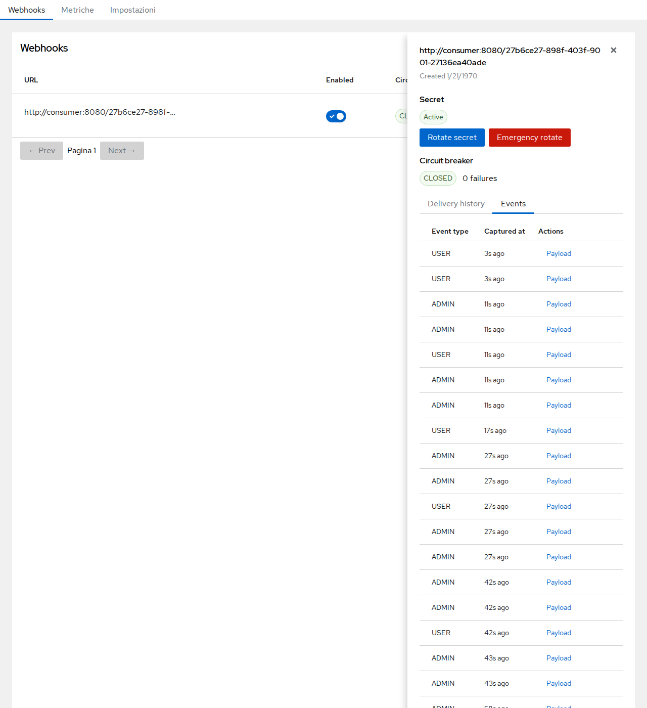

# Webhook Admin UI — Guida Utente

Questa guida descrive l'interfaccia di amministrazione dei webhook, accessibile all'indirizzo:

```
/realms/{realm}/webhooks/ui
```

L'accesso richiede il ruolo realm `webhook-admin`.

---

## 1. Lista webhook


La schermata principale mostra tutti i webhook configurati nel realm. Per ogni webhook sono visibili:

| Colonna | Descrizione |
|---------|-------------|
| **URL** | L'endpoint che riceve le richieste POST |
| **Enabled** | Toggle per abilitare o disabilitare la consegna senza eliminare il webhook |
| **Circuit** | Stato attuale del circuit breaker: `OPEN` (funzionante) o `CLOSED` (scattato) |
| **Events** | Numero di tipi di evento sottoscritti |
| **Actions** | Menu per modifica ed eliminazione |

Cliccando su una riga si apre il **pannello Delivery** per quel webhook.

---

## 2. Creazione di un webhook


Cliccando su **+ Create webhook** si apre il form di creazione. I campi disponibili sono:

- **URL** — l'endpoint HTTPS che riceverà gli eventi.
- **Enabled** — indica se la consegna inizia subito dopo la creazione.
- **Secret** — segreto HMAC opzionale. Quando impostato, ogni richiesta include l'header `X-Webhook-Signature` per consentire la verifica dell'autenticità da parte del ricevitore.
- **Algorithm** — algoritmo HMAC per la firma (`HmacSHA256` consigliato).
- **Max-retry duration** — finestra temporale totale in secondi entro cui vengono effettuati i retry (default: 900 s / 15 min).
- **Max-retry interval** — intervallo massimo di back-off in secondi tra un tentativo e il successivo.

Cliccare **Save** per creare il webhook. Cliccare **Cancel** o premere `Esc` per annullare.

---

## 3. Cronologia consegne


Cliccando su una riga si apre un pannello laterale con i dettagli delle consegne per quel webhook.

L'intestazione del pannello mostra l'**URL** di destinazione completo.

### Secret

La sezione **Secret** mostra lo stato attuale della chiave di firma (`Active` o `Rotating`). Da qui è possibile avviare una rotazione graduale o una rotazione di emergenza. Per i dettagli vedi [Sezione 7 — Rotazione del secret](#7-rotazione-del-secret).

### Circuit breaker

Sotto la sezione Secret, il badge di stato del **Circuit breaker** (`OPEN` / `CLOSED`) e il pulsante **Reset circuit** permettono di ispezionare e ripristinare manualmente il circuit. Per i dettagli vedi [Sezione 4 — Circuit breaker](#4-circuit-breaker).

### Scheda Delivery history

La scheda **Delivery history** elenca i tentativi di consegna recenti. Ogni riga mostra:
- Il codice di **status** HTTP (spunta verde = 2xx, X rosso = errore)
- Il numero di **retry** per quel tentativo
- Il timestamp **Sent at**
- Una colonna **Actions** con le opzioni **Resend** e **Payload**

Il pulsante **Resend failed** permette di ripetere tutte le consegne fallite per quel webhook.

Cliccando **Payload** su qualsiasi riga si apre una modale con il payload JSON completo inviato per quella consegna.

### Scheda Events



La scheda **Events** elenca gli eventi Keycloak grezzi ricevuti per questo webhook, prima che vengano spediti. Ogni riga mostra:
- Il **tipo di evento** (es. `USER`, `ADMIN`)
- Il timestamp **Captured at**
- Una colonna **Actions** con un pulsante **Payload** per ispezionare il JSON dell'evento

### Paginazione

I pulsanti **← Prev** e **Next →** in fondo alla tabella permettono di navigare tra le pagine. Il numero di righe per pagina è configurabile in **Impostazioni → Cronologia consegne** (predefinito: 50). Il pulsante **Next** è disabilitato sull'ultima pagina; **Prev** è disabilitato sulla prima pagina.

---

## 4. Circuit breaker


Il circuit breaker protegge i servizi downstream da richieste ripetute in caso di errori. Quando troppi tentativi di consegna consecutivi falliscono, il circuit **scatta** (lo stato passa da `OPEN` a `CLOSED`) e la consegna viene sospesa.

- **OPEN** — il circuit è funzionante; le consegne procedono normalmente.
- **CLOSED** — il circuit è scattato; le consegne sono in pausa finché non viene ripristinato.

Cliccare **Reset circuit** nell'intestazione del pannello per riaprire manualmente il circuit e riprendere le consegne.

---

## 5. Metriche


La scheda **Metriche** mostra statistiche aggregate sulle consegne per il realm.

| Card | Descrizione |
|------|-------------|
| **Dispatches** | Totale tentativi di consegna HTTP |
| **Events received** | Totale eventi Keycloak ricevuti e accodati |
| **Retries** | Totale retry pianificati |
| **Queue pending** | Task attualmente in attesa nell'esecutore |

Il tasso di successo viene mostrato sotto il contatore delle consegne:
- **Verde** — ≥ 95% di successo
- **Arancione** — < 95% di successo

Il toggle **Auto-refresh** abilita l'aggiornamento automatico. L'intervallo è configurabile nel tab **Impostazioni** (default: 10 secondi).  
Il pulsante **Aggiorna** forza un aggiornamento immediato.

---

## 6. Metriche raw Prometheus


Espandere la sezione **Raw Prometheus** in fondo alla pagina Metriche per visualizzare l'output nel formato testo Prometheus.

Lo stesso endpoint è disponibile direttamente per lo scraping:

```
GET /realms/{realm}/webhooks/metrics
Authorization: Bearer <token>
```

La risposta usa il formato testo Prometheus 0.0.4 ed espone le seguenti famiglie di metriche:

| Metrica | Tipo | Descrizione |
|---------|------|-------------|
| `webhook_events_received_total` | counter | Eventi ricevuti per realm e tipo |
| `webhook_dispatches_total` | counter | Tentativi di consegna per esito (successo/errore) |
| `webhook_retries_total` | counter | Retry pianificati |
| `webhook_retries_exhausted_total` | counter | Catene di retry terminate senza successo |
| `webhook_queue_pending` | gauge | Task in attesa nell'esecutore |

---

## 7. Rotazione del secret

Ruotare un secret di webhook è un'operazione in due fasi, senza interruzione del servizio: mentre la rotazione è in corso, le richieste in uscita contengono firme sia del nuovo che del vecchio secret, permettendo ai consumer di aggiornare la loro chiave di verifica senza perdere eventi.

### Avviare una rotazione

Aprire il webhook nell'interfaccia di amministrazione e cliccare su **Rotate secret** nella scheda Secret del pannello. Scegliere un periodo di grazia (1, 7 o 30 giorni) e confermare. Una modale mostra il nuovo secret una sola volta — copiarlo e configurarlo lato consumer. Il vecchio secret continua a verificare le firme fino al termine del periodo di grazia o fino a quando non si clicca su **Complete rotation now**.

### Rotazione di emergenza

Se il secret attuale è stato compromesso, cliccare su **Emergency rotate**. Verrà richiesto di digitare `rotate` per confermare. Il nuovo secret sostituisce quello vecchio immediatamente — non c'è un periodo di grazia e il vecchio secret viene invalidato. Usare questa opzione solo in caso di compromissione; interromperà qualsiasi consumer che utilizza ancora il vecchio secret finché non viene aggiornato.

### Verifica degli header multi-firma lato consumer

Durante la rotazione, l'header `X-Keycloak-Signature` contiene un elenco di firme separate da virgole:

```
X-Keycloak-Signature: sha256=<hex1>, sha256=<hex2>
```

Verificare iterando le firme e accettando il payload se **una qualsiasi** firma corrisponde:

```python
def verify(payload_bytes, header, secrets):
    parts = [p.strip() for p in header.split(",")]
    for part in parts:
        if not part.startswith("sha256="):
            continue
        received = part[len("sha256="):]
        for secret in secrets:
            expected = hmac.new(secret.encode(), payload_bytes, hashlib.sha256).hexdigest()
            if hmac.compare_digest(expected, received):
                return True
    return False
```

### Metriche e audit trail

- `webhook_secret_rotations_total{mode}` — conteggio delle rotazioni per modalità (`graceful`, `emergency`, `expired`)
- `webhook_rotations_in_progress{realm}` — numero attuale di webhook in rotazione
- Eventi di log strutturati: `webhook.secret.rotated`, `webhook.rotation.completed`, `webhook.rotation.expired`

---

## 8. Impostazioni


Il tab **Impostazioni** espone le opzioni di configurazione dell'interfaccia, persistite nel `localStorage` del browser tra una sessione e l'altra.

### Intervallo auto-refresh metriche

Controlla la frequenza con cui la pagina Metriche interroga automaticamente l'endpoint `/metrics` quando l'**Auto-refresh** è abilitato.

| Opzione | Valore |
|---------|--------|
| 5 secondi | 5 s |
| **10 secondi** *(default)* | 10 s |
| 30 secondi | 30 s |
| 60 secondi | 60 s |

La selezione ha effetto immediato — non è richiesto alcun salvataggio. L'impostazione persiste al ricaricamento della pagina.

### Webhook — valori predefiniti

Valori predefiniti applicati alla **creazione** di un nuovo webhook. I webhook esistenti non vengono modificati.

| Impostazione | Default | Descrizione |
|--------------|---------|-------------|
| **Enabled by default** | Attivo | Se i nuovi webhook iniziano attivi (consegnano eventi) subito dopo la creazione. Disattivare per creare webhook in stato disabilitato e abilitarli manualmente quando pronti. |
| **Max retry duration (seconds)** | Vuoto (default server: 900) | Finestra temporale totale per i tentativi di retry. Lasciare vuoto per usare il default del server (900 s / 15 min). |
| **Max retry interval (seconds)** | Vuoto (default server: 180) | Intervallo massimo di back-off tra i tentativi di retry. Lasciare vuoto per usare il default del server (180 s / 3 min). |

Le modifiche hanno effetto immediato — non è richiesto alcun salvataggio. Le impostazioni persistono al ricaricamento della pagina.

### Cronologia consegne

Controlla il numero di righe visualizzate per pagina nel drawer della cronologia consegne.

| Opzione | Valore |
|---------|--------|
| 10 | 10 righe |
| 25 | 25 righe |
| **50** *(default)* | 50 righe |
| 100 | 100 righe |

### Configurazione server

Impostazioni lato server persistite nel database di Keycloak e applicate a tutti gli utenti del realm.

| Impostazione | Default | Descrizione |
|--------------|---------|-------------|
| **Event retention (days)** | 30 | Per quanti giorni gli eventi Keycloak grezzi vengono mantenuti nel database prima di essere eliminati. |
| **Send retention (days)** | 90 | Per quanti giorni i record di consegna (send) vengono mantenuti prima di essere eliminati. |
| **Circuit failure threshold** | 5 | Numero di errori consecutivi prima che il circuit scatti su `CLOSED`. |
| **Circuit open duration (seconds)** | 60 | Per quanto tempo il circuit rimane `CLOSED` prima di poter essere ripristinato manualmente. |

Le modifiche vengono salvate automaticamente alla perdita del focus (nessun pulsante di salvataggio esplicito).
